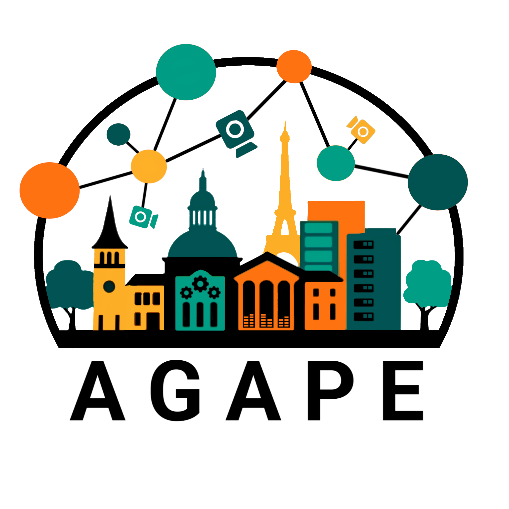
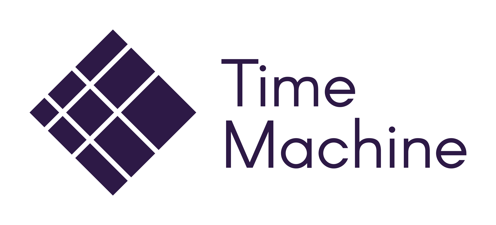

---
#
# By default, content added below the "---" mark will appear in the home page
# between the top bar and the list of recent posts.
# To change the home page layout, edit the _layouts/home.html file.
# See: https://jekyllrb.com/docs/themes/#overriding-theme-defaults
# <h3 class="blackpar_title">(Models, Training and Inference)</h3>
layout: home
---

	

		  
		<h2 class="blackpar_title">CHOMPS 2025</h2>
		<h3 class="blackpar_title">The 1st workshop on <a style="color: rgb(164, 0, 0)">C</a>onfabulation, <a style="color: rgb(164, 0, 0)">H</a>allucinations & <a style="color: rgb(164, 0, 0)">O</a>vergeneration in <a style="color: rgb(164, 0, 0)">M</a>ultilingual and <a style="color: rgb(164, 0, 0)">P</a>ractical <a style="color: rgb(164, 0, 0)">S</a>ettings</h3>
	    <h4 class="blackpar_title" style="font-family:'Source Pro'; font-weight: 400;"> Advances in hallucination mitigation in practical situations:  multilingual and precision-critical domains</h4>
		<h5 class="blackpar_title" style="font-family:'Source Pro'; font-weight: 400;"><b>In conjunction with <a href="https://www.afnlp.org/conferences/ijcnlp2025/"> AACL-IJCNLP 2025 </a>  23-24 December, 2025, Mumbai, India (On-Site)</b></h5>
		  	
	

 

<!--

  <h4>Mentoring sessions announcement</h4>
  

  The deadline for submitting papers to our second version of the Efficient Natural Language and Speech Processing (ENLSP-II) workshop is 25th of September. For that we will be scheduling two mentioring online sessions to answer your questions. Please join us:
   
  <ul>
	<li>Tuesday the 6th of September 2022 from 10PM to 11PM (UTC-04:00)</li>
	<li>Wednesday the 7th of September 2022 from 9AM to 10AM (UTC-04:00)</li>
	<li>Tuesday the 13th of September 2022 from 10PM to 11PM (UTC-04:00): <a href="https://welink.zhumu.com/j/134854021">link</a></li>
	<li>Wednesday the 14th of September 2022 from 9AM to 10AM (UTC-04:00): <a href="https://welink.zhumu.com/j/130263276">link</a></li>
  </ul>
  

 
-->

<!--

 <b> Best Paper Award </b> - <em>"Creating a Dataset for the Detection and Segmentation of Degradation Phenomena in Notre-Dame de Paris" </em> - Laura Willot, Kévin Réby, Adeline Manuel, Dan Vodislav, Valerie Gouet-Brunet, Livio De Luca.

-->

<!-- News and Updates -->
<h2 class="blackpar_title" id="bews">News and Updates</h2>

<ul>
<!--	<li> <b>[2 Nov, 2023]</b> <b>SUMAC 2023 Best Paper Award</b> goes to <em>"Why Don’t You Speak?: A Smartphone Application to Engage Museum Visitors Through Deepfakes Creation" </em> - Matteo Zaramella, Irene Amerini, Paolo Russo.</li>
	<li> <b>[1 Nov, 2023]</b> The <b>D-day</b> is almost here & we are excited to meet you all tomorrow - <b>2 Nov, 2023</b><a href="index.html#schedule"> [Schedule]</a></li>
	<li> <b>[18 Oct, 2023]</b> <a href="index.html#schedule">Workshop Schedule Announced!</a></li>
	<li> <b>[20 July, 2023]</b> <a href="index.html#imp_dates">Important dates further extended</a></li>
	<li> <b>[18 July, 2023]</b> <a href="https://openreview.net/group?id=acmmm.org/ACMMM/2023/Workshop/SUMAC">Submission deadline extended to 27 July</a><li>
	<li> <b>[28 June, 2023]</b> <a href="index.html#speakers">Keynotes</a> & <a href="index.html#program_committee">Program Committee Announced</a></li>
-->
<!-- 	<li> <b>[19 Dec, 2024]</b> Presentor Slides are now available. Links are provided at the end of the <a href="index.html#schedule">Talk Titles</a></li>
	<li> <b>[06 Nov, 2024]</b> Best paper award goes to <em>"Creating a Dataset for the Detection and Segmentation of Degradation Phenomena in Notre-Dame de Paris" </em><a href="https://dl.acm.org/doi/10.1145/3689094.3689473"> [ACM DL Link]</a>, presented by <b>Laura Willot</b>
	<li> <b>[22 Oct, 2024]</b> <a href="index.html#schedule">Schedule Announced</a></li>
	<li> <b>[22 Oct, 2024]</b> <a href="index.html#accepted_papers">List of Accepted Papers with their links</a></li>
	<li> <b>[20 Aug, 2024]</b> Workshop date announced: 28-Oct, 2024.</li>
	<li> <b>[10 Aug, 2024]</b><a href="https://2024.acmmm.org/important-dates"> Camera-ready paper deadline and Author registration deadline is 22-August-2024.</a></li>
	<li> <b>[10 Aug, 2024]</b><a href="https://openreview.net/group?id=acmmm.org/ACMMM/2024/Workshop/SUMAC"> The paper decisions are released on OpenReview.</a></li>
	<li> <b>[16 July, 2024]</b> <a href="index.html#imp_dates">Deadline Extended to 12.59 PM, 24 July, 2024</a> <a href="https://www.timeanddate.com/worldclock/timezone/utc">UTC-0</a></li>
	<li> <b>[24 June, 2024]</b> <a href="index.html#speakers">Keynote Speakers Announced</a></li>
	<li> <b>[24 June, 2024]</b> <a href="index.html#program_committee">Program Comittee Announced</a></li>
	<li> <b>[17 June, 2024]</b> <a href="index.html#imp_dates">Important Dates</a></li>
	<li> <b>[17 June, 2024]</b> <a href="https://openreview.net/group?id=acmmm.org/ACMMM/2024/Workshop/SUMAC">Submissions Site Open!</a><a href="index.html#submission_guide">Submissions Guidelines.</a></li>
-->
	<li> <b>[26 May, 2025]</b> <a href="https://chomps2025.github.io/">Website Launched!</a></li>
</ul>

 

<h2 class="blackpar_title" id="overview">Overview</h2>

 The aim of the CHOMPS workshop is to find ways to mitigate one of major the hurdles that currently prevent the adoption of Large Language Models in real-world scenarios: namely, their tendency to hallucinate, i.e., produce unsupported and unverifiable text that sounds deceptively plausible.

 
<!-- Call for Papers -->
<h2 class="blackpar_title" id="call_for_papers">Call for Papers</h2>

 The workshop will explore hallucination mitigation in practical situations, where this mitigation is crucial: in particular, precision-critical applications (such as those in the medical, legal and biotech domains), as well as multilingual settings (given the lack of resources available to reproduce what can be done for English in other linguistic contexts). In practice, we intend to invite works of the following (not exclusive) list of topics: 

<ul>
	<li> Metrics, benchmarks and tools for hallucination detection</li>
	<li> Factuality challenges in mission critical & domain-specific (e.g., medical, legal, biotech) and their consequences on societal, engineering and practical levels</li>
	<li> Mitigation strategies during inference or model training</li>
	<li> Studies of hallucinatory and confabulatory behaviors of LLMS in cross-lingual and multilingual scenarios</li>
	<li> Confabulations in language & multimodal (vision, text, speech) models</li>
	<li> Perspectives and case studies from other disciplines</li>
</ul>
<!--

The scope of targeted applications is extensive and includes:

<ul>
	<li>Analysis, archaeometry of artifacts</li>
	<li> Diagnosis and monitoring for restoration and preventive conservation</li>
	<li> Geosciences / Geomatics for cultural heritage</li>
	<li> Education</li>
	<li> Smart and sustainable tourism </li>
	<li> Urban planning</li>
	<li> Digital Twins</li>
</ul>
-->

 

<h2 class="blackpar_title" id="imp_dates">Important dates</h2>

<ul>

 	<li>Paper submission: September 29, 2025 <a href="https://www.timeanddate.com/time/zones/sst">UTC/GMT-11</a></li>
	<li>ARR commitment: October 27, 2025</li>
	<li>Author notification: November 3, 2025</li>
	<li>Camera-Ready: November 11, 2025</li>
	<li>Workshop date: December 23-24, 2025 (TBA)</li>
</ul>
 

<h2 class="blackpar_title" id="submission_guide">Submission guidelines</h2>

<b>Submission format</b>  All submissions must be original work not under review at any other workshop, conference, or journal. The workshop will accept papers describing completed work (full paper) as well as work in progress (short paper). Two submission formats are accepted:
<ul>
 <li> 4 pages (short paper);</li>
 <li> 8 pages (long paper).</li>
</ul> 

<!-- more details --
  They must be encoded as PDF using the ACM Article Template of the main conference ACM Multimedia 2025 <a href="https://acmmm2025.org/information-for-authors/"> (https://acmmm2025.org/information-for-authors/)</a>.

<b>Peer Review and publication in ACM Digital Library</b> Paper submissions must conform with the “double-blind” review policy. All papers will be peer-reviewed by experts in the field, they will receive at least two reviews. Acceptance will be based on relevance to the workshop, scientific novelty, and technical quality. Depending on the number, maturity and topics of the accepted submissions, the work will be presented via oral or poster sessions. The workshop papers will be published in the ACM Digital Library.

<b>Profile Registration</b> A registered profile at OpenReview (submissions' portal) is required to submit a paper.

IMP NOTES:
<ul>
	<li> New profiles created without an institutional email will go through a moderation process that can take up to two weeks.</li>
	<li> New profiles created with an institutional email will be activated automatically.</li>
</ul>
-->

<b>Submissions' Site</b> TBA 

<!-- Special Highlights 
<h2 class="blackpar_title" id="highlights">Special Highlights</h2>

 <b>Best Paper Award - </b>We will present a best paper award, accompanied with a certificate and a trophy, similar to previous editions. 

-->
<!-- 
 <b>Journal Special Issue - </b>Authors of the best papers from SUMAC 2023 will be invited to submit an extended and improved version for consideration for Special Issue on Cultural Heritage in the Springer journal Multimedia Tools and Applications.

-->
 
<!--Confirmed Speakers-->
<h2 class="blackpar_title" id="speakers">Keynote Speakers</h2>



 

<!-- 
<h2 class="blackpar_title" id="accepted_papers">Accepted Papers</h2>

<ul>
	<li><b>Personalized Generative Storytelling with AI-Visual Illustrations for the Promotion of Knowledge in Cultural Heritage Tourism</b> - <em>Andrea Ferracani, Marco Bertini, Pietro Pala, Gabriele Nannotti, Filippo Principi, Giuseppe Becchi</em><a href="https://dl.acm.org/doi/10.1145/3689094.3689465"> [ACM DL Link]</a></li>
	<li><b>Creating a Dataset for the Detection and Segmentation of Degradation Phenomena in Notre-Dame de Paris</b> - <em>Laura Willot, Kévin Réby, Adeline Manuel, Dan Vodislav, Valerie Gouet-Brunet, Livio De Luca</em><a href="https://dl.acm.org/doi/10.1145/3689094.3689473"> [ACM DL Link]</a></li>
	<li><b>Historical Postcards Retrieval through Vision Foundation Models</b> - <em>Anis Amri, Salvatore Tabbone</em><a href="https://dl.acm.org/doi/10.1145/3689094.3689471"> [ACM DL Link]</a></li>
	<li><b>Scene Classification on Fine-arts with Style Transfer</b> - <em>Haiting Huang, Mathias Zinnen, Shumei Liu, Andreas Maier, Vincent Christlein</em><a href="https://dl.acm.org/doi/10.1145/3689094.3689468"> [ACM DL Link]</a></li>
	<li><b>4D Geo Modelling from Different Sources at Large Scale</b> - <em>Sander Muenster, Jonas Bruschke, Daniel Dworak, Dávid Komorowicz, Vaibhav Rajan, Dominik Ukolov</em><a href="https://dl.acm.org/doi/10.1145/3689094.3689466"> [ACM DL Link]</a></li>
	<li><b>Understanding User Engagement in Museum TikTok Videos by Exploring Multimodal Cues</b> - <em>Chek Zi Yan Jane, John See, Jessica Sze Yin Ho, Lau Pei Mey, Padma Pillai</em><a href="https://dl.acm.org/doi/10.1145/3689094.3689467"> [ACM DL Link]</a></li>
	<li><b>Hand Gesture Recognition in Buddhist Art Images: Evaluation of a Keypoint-based Approach</b> - <em>Li Weng</em><a href="https://dl.acm.org/doi/10.1145/3689094.3689464"> [ACM DL Link]</a></li>
</ul>

 -->
 

<!-- Schedule -->

<!-- <h2 class="blackpar_title" id="schedule">Schedule (Melbourne local time, 28 Oct) </h2>

 <b>Keynotes</b>: 40 min talk + 10 min Q&A
 

 <b>Orals</b>: 20 min talk + 5 min Q&A
 

 <b>Posters</b>: 10 min talk + 3 min Q&A



  -->

<!-- Technical Committee -->
<h2 class="blackpar_title" id="program_committee">Program Committee</h2>



 

<!-- Organizers -->
<h2 class="blackpar_title" id="organizers">Organizers</h2>



 

<h2 class="blackpar_title">Sponsors</h2>

Please reach out to us at chomps-aacl2025@googlegroups.com

<!--

	

		

			
		

	

	

		

			
		

	

	

		
		
			
		

	

	

		

			
		

	

 
-->

<!-- <h2 class="blackpar_title">Gold Sponsor</h2>

	

		

			
		

	

	

		

			
		

	

 -->

<!-- Previous Editions 
<h2 class="blackpar_title" id="previous_editions">Previous Editions</h2>



-->